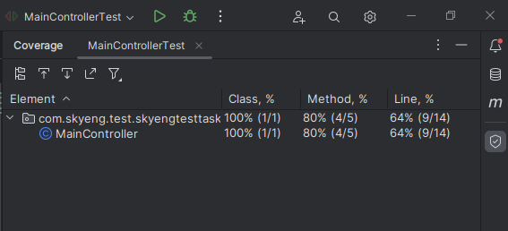

Для тестирования API перейдите по http://195.133.75.218:8080/swagger-ui/index.html

## Описание API

### Регистрация почтового отправления

Метод: `POST /api/register_mailing`

Описание: Регистрирует новое почтовое отправление.

Параметры запроса:
```
{
    "identifier": 123,
    "type": "PACKAGE",
    "recipientIndex": "123456",
    "recipientAddress": "ул. Пушкина, д. Колотушкина, кв. 15",
    "recipientName": "Иван Иванов"
}
```

Параметры ответа:
```
{
    "id": 1,
    "identifier": 123,
    "type": "PACKAGE",
    "recipientIndex": "123456",
    "recipientAddress": "ул. Пушкина, д. Колотушкина, кв. 15",
    "recipientName": "Иван Иванов"
}
```

### Регистрация почтового пути

Метод: `POST /api/register_way`

Описание: Регистрирует новый почтовый путь для заданного почтового отправления.

Параметры запроса:
```
{
    "mailing": {
        "id": 1,
        "identifier": 123,
        "type": "PACKAGE",
        "recipientIndex": "123456",
        "recipientAddress": "ул. Пушкина, д. Колотушкина, кв. 15",
        "recipientName": "Иван Иванов"
    },
    "postOffice": {
        "id": 1,
        "index": 123456,
        "name": "Отделение связи №1",
        "address": "ул. Ленина, д. 1"
    },
    "status": "DEPARTED",
    "dateTime": "2023-08-17T10:00:00"
}
```

Параметры ответа:
```
{
    "id": 1,
    "mailing": {
        "id": 1,
        "identifier": 123,
        "type": "PACKAGE",
        "recipientIndex": "123456",
        "recipientAddress": "ул. Пушкина, д. Колотушкина, кв. 15",
        "recipientName": "Иван Иванов"
    },
    "postOffice": {
        "id": 1,
        "index": 123456,
        "name": "Отделение связи №1",
        "address": "ул. Ленина, д. 1"
    },
    "status": "DEPARTED",
    "dateTime": "2023-08-17T10:00:00"
}
```

### Получение полного списка почтовых путей для заданного почтового отправления

Метод: `GET /api/full_way/{id}`

Описание: Возвращает список всех почтовых путей для заданного почтового отправления.

Параметры запроса:
- `id` - идентификатор почтового отправления

Параметры ответа:
```
[
    {
        "id": 1,
        "mailing": {
            "id": 1,
            "identifier": 123,
            "type": "PACKAGE",
            "recipientIndex": "123456",
            "recipientAddress": "ул. Пушкина, д. Колотушкина, кв. 15",
            "recipientName": "Иван Иванов"
        },
        "postOffice": {
            "id": 1,
            "index": 123456,
            "name": "Отделение связи №1",
            "address": "ул. Ленина, д. 1"
        },
        "status": "DEPARTED",
        "dateTime": "2023-08-17T10:00:00"
    },
    {
        ...
    }
]
```

### Получение информации о посылке

Метод: `PUT /api/receipt/{id}`

Описание: Помечает последний почтовый путь посылки как полученный.

Параметры запроса:
- `id` - идентификатор последнего почтового пути посылки

Параметры ответа:
```
{
    message: 'Посылка успешно получена'
}
```

В ответе может также быть возвращена ошибка с сообщением `"Посылка не найдена"`.


Тесты:
